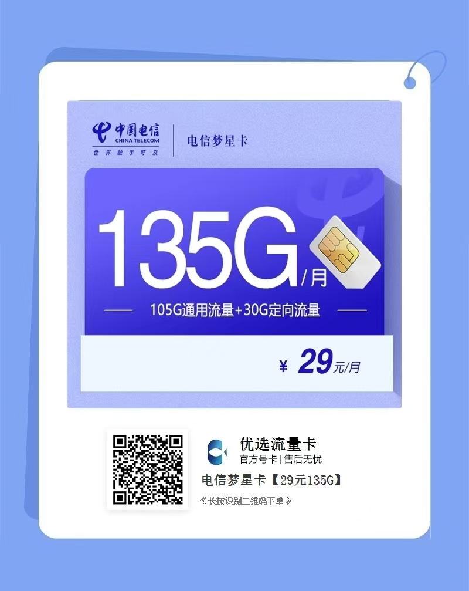

# 流量卡

[点击前往](https://h5.lot-ml.com/ProductEn/Index/38a51af190afbde1)

本文是2025年流量卡选购指南，为大家在选购流量卡的过程中，答疑解惑，同时包含2025年高性价比流量卡推荐，方便选择困难症的知友查看。流量卡价格目前是全年最低点，是入手流量卡的好时机。

今年已经测评过30款新品手机卡，历时至今，已经获得900W+的阅读。

## 流量卡多少价格适合入手
看寒暑期，流量卡最适合入手的就是寒暑期这两个大节点，寒暑期的价格基本上是全年最低价，会有很多29、39元的低价套餐，适合自己使用都可以入手。

除了寒暑期外，偶尔也会上架一些价格较低的互联网套餐，以达到补充业绩的目的。

## 流量卡选购指南

### 流量

选购流量卡一定要看清楚流量详情，不要单纯的只看流量总数，因为流量也是有多种分类的，例如：
”通用流量“：没有任何限制的流量
”定向流量“：只限制某些固定app才可以使用的流量
”闲时流量“：只可以在夜间00：00-早8：00时间段内才可以使用的流量

建议大家选购时根据自身的需求查看通用流量足够自己使用的套餐，这样可以保证自己的正常使用，避免出现”月底流量余额还很多，但是全部是定向流量，无法使用”的尴尬局面。

### 通话

大部分套餐都是不附带免费通话的，一般都是0.1元/分钟的收费标准
也有小部分套餐会配置100-300分钟的免费通话，但是相对应的在其他的方面优惠会有所减免

如果自身的通话需求很小、还是建议优先选择把优惠倾斜到流量方面的套餐，毕竟每分钟一毛钱也不会收多少钱，如果确实有较大的通话需求，可以按照符合自身需求量的套餐选择。

### 网速

网速分为普通4G、普通5G、5G黄金速率、5G白金速率等几个常见配置

普通4G就是对应着我们常见的100mbps的宽带，这种网速可以正常收发消息，但是进入网页，刷视频，缓存电视剧就会比较慢一些，为了响应5G的发展，现在市面上的套餐很少有4G的了

普通5G就是对应着我们常见的300mbps的宽带，这种网速基本上刷网页，刷视频都会很顺畅了

5G黄金速率对应着我们常见的500mbps的宽带，这种网速基本上下载大型app也会很快了，比如常用的微信，在这个网速情况下，最快只需要10.48秒就可以下载到

5G白金速率对应着我们常见的1000mbps的宽带，这种网速基本上下载大型网络游戏也就是分分钟的事情

### 优惠期

线上的套餐一般不会和线下营业厅办理的套餐一样，可以长期使用，大部分都是有优惠期的。

因为这些套餐都是运营商为了补充业绩给降价推出的，一般优惠力度都会给的很大，以便可以短期补充够业绩，业绩够了也就下架了。

同时这些套餐给到的优惠基本上都是运营商已经到了不赚钱甚至亏钱的程度，所以很少有长期优惠的套餐。

如果看到套餐既优惠，同时还是长期有效的套餐，那就不要犹豫，赶快入手。

如果某些时间段内没有长期套餐，那么就矮子里面挑大个，挑选相对而言优惠期较长的套餐。

### 合约期

上一条讲到了这些优惠套餐基本上都是运营商为了冲业绩才上架的，那么运营商公司内部也有考核机制，比如说这批新用户需要用满一年才算正常考核的业绩

这种情况下，运营商就会将某些流量卡的合约期设置为1年，1年内注销会有违约金，这样可以保留更多的用户使用满1年。

但是这个合约期对我们而言又算是一个束缚，因为他会影响我们注销，所以选择流量卡时可以优先选择没有合约期的套餐。

## 注意事项

1、为防快递偷换卡,激活前查订单核对号码，激活的时候流量和卡名显示的是原套餐，不用管，按要求首充会有优惠，流量到账需要时间，一般1-3天，刚激活的等一下
2、地址不要填公共及模糊区域，如学校，驿站，超市，酒店，旁边，附近等，直接写什么路后面随便加个1栋101之类的，详细地址一栏不要包含省市区信息
3、隔天查一下订单状态，如显示“审核不通过”“已撤单”就是这张卡不发你那个地区，换其他套餐申请，同一张卡重复申请不会增加成功率，广州天河和成都郫县所有卡都不发，要找个其他区的地址收货，下单查不到订单信息的就是手机填错了，私信我姓名查询
4、小部分人会触发风险校验短信，尽快按短信提示复机
5、运营商直发正规5G电话卡(4g手机通用)，没有5G信号的打运营商电话转人工开通一下5g
6、所有卡的流量都是每个月的，不限速，不虚标，app可查，线上销户
7、所有卡激活后都是全国通用，发货禁区只是不发货，不是不能用
8、有任何问题请联系客服
